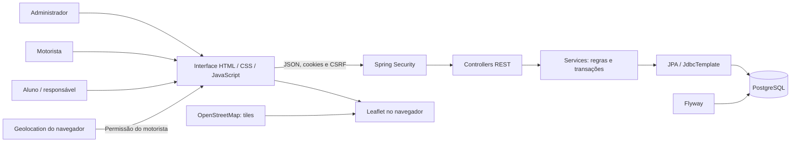
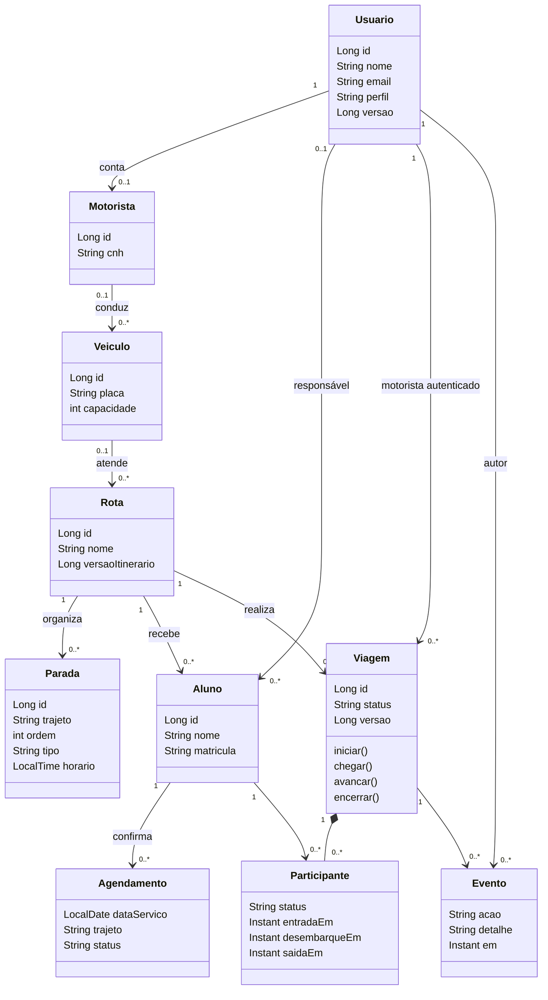
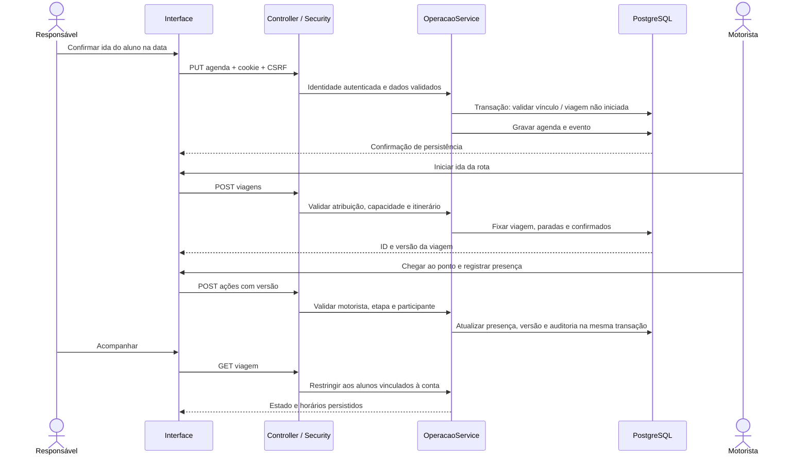
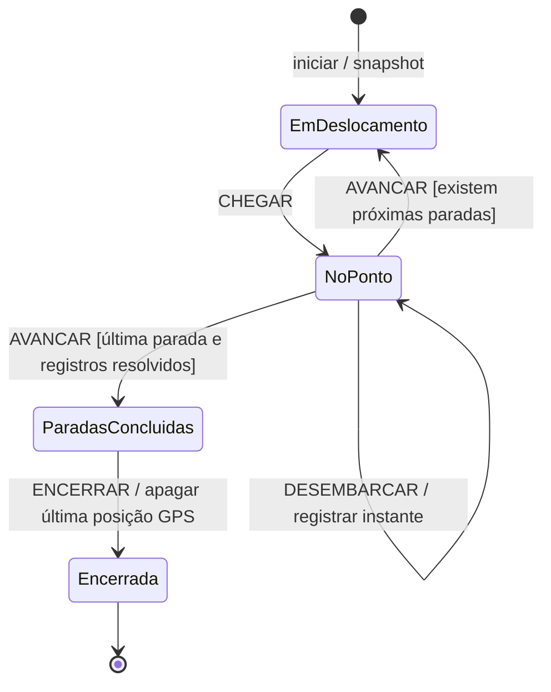
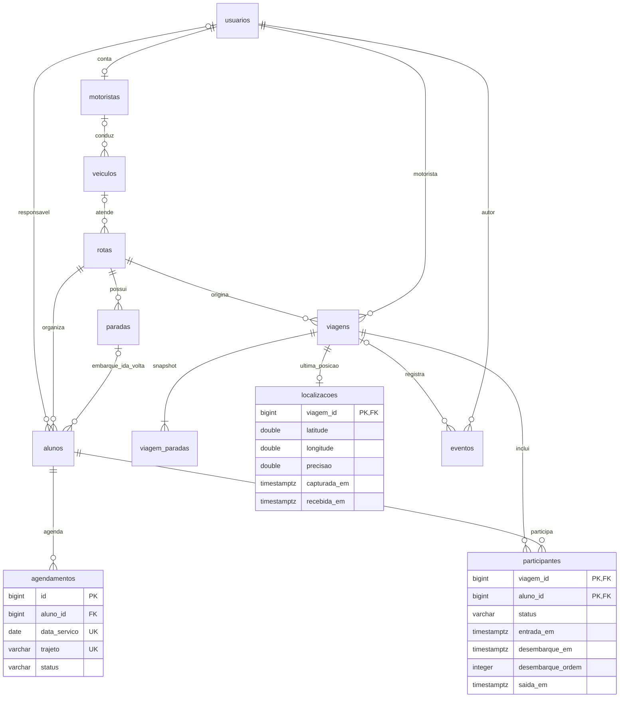

# Modelagem do Mobilys

Os diagramas desta seção representam a base das migrações V1–V6; os
complementos V7 e V8 estão descritos ao final. Diagramas de classes,
sequência e estados abaixo usam notação UML suportada pelo Mermaid; o último
diagrama usa notação entidade-relacionamento, não UML. O diagrama de casos de
uso em PlantUML está em [casos-de-uso.puml](casos-de-uso.puml).

## Arquitetura

O Spring Boot também serve os arquivos estáticos empacotados, permitindo
executar a aplicação na mesma origem. Live Server continua disponível para
edição do frontend. As regras permanecem no servidor. A visualização de mapa
usa tiles externos; nomes, alunos e credenciais não são enviados ao provedor.
O carregamento do mapa revela ao provedor os tiles da região visualizada e o IP
do navegador, como ocorre em serviços de mapas web.

## Classes conceituais do domínio

É um modelo conceitual: no código, parte das entidades usa JPA e parte é
manipulada por JdbcTemplate. Os métodos operacionais estão em `OperacaoService`.

## Sequência: confirmação, viagem e presença

## Estados operacionais

No banco, os três estados intermediários são derivados de `EM_ANDAMENTO`,
`ponto_atual` e `no_ponto`. Após encerrar, as ações são recusadas. Versão antiga
retorna 409; não aplica novamente uma transição.

## Estrutura relacional

Unicidades compostas: agenda `(aluno_id, data_servico, trajeto)`; viagem
`(rota_id, data_servico, trajeto)`; paradas `(rota_id, trajeto, ordem)`;
participante `(viagem_id, aluno_id)`. A ligação de paradas a alunos representa
duas FKs opcionais, uma para cada trajeto. O veículo da viagem é preservado pela
placa em snapshot e, desde V7, também pela FK `veiculo_id`.
`parada_original_id` do snapshot não tem
FK: permite manter o histórico após editar o itinerário original.

O DDL completo e as restrições estão em `backend/src/main/resources/db/migration`.

## Complementos V7 e V8

Os diagramas aprovados fornecidos pelo autor permanecem inalterados. A V7
adiciona responsáveis N:N, conta própria do aluno, pontos autorizados e
associações de veículos/motoristas, descritos na
[adequação ao modelo aprovado](ADEQUACAO-MODELO-APROVADO.md).

| Estrutura V8 | Papel |
| --- | --- |
| `agendamentos.destino_id` → `paradas.id` | Destino escolhido por aluno, data e trajeto; FK impede excluir uma parada referenciada |
| `participantes.destino_ordem` | Destino fixado no itinerário da viagem; não depende do cadastro atual da parada |
| `viagem_paradas.omitida_em` e `motivo_omissao` | Registro de um ponto pulado na volta, sem simular chegada |
| `eventos.acao = OMITIR_PARADA` | Autor, instante, ordem/local e motivo da omissão |

Na confirmação, o servidor valida rota, trajeto, tipo e ordem do destino.
No início, valida novamente e copia a ordem para o participante. Ao avançar
na volta, verifica a demanda de desembarque e registra as omissões e a versão
da viagem na mesma transação. Embarques e pontos mistos permanecem no percurso.
Presentes precisam desembarcar no destino antes do avanço. Dados anteriores
à V8 permanecem sem destino, sem inferência retroativa de fatos históricos.
